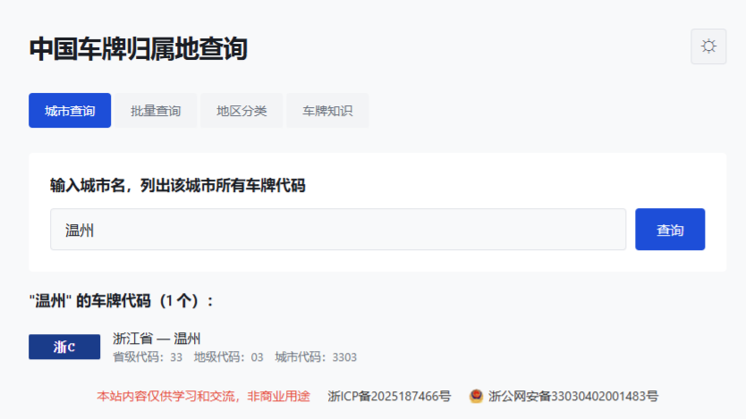

# 中国车牌归属地查询

一个纯前端车牌查询工具，支持城市反向查询、批量校验、新能源车牌识别、地区分类浏览和车牌编码知识科普。

## 功能

- **城市查询**：输入城市名，列出该城市所有车牌代码及行政区划数字代码
- **批量查询**：粘贴多行车牌号，一次性输出归属地与格式校验结果
- **地区分类**：按华北/华东/华南等大区折叠展示各省份城市车牌，点击直达城市查询
- **车牌知识**：蓝/绿/黄/白/黑牌照用途区分、编码规则说明、特殊车牌（使馆/军车/警车等）识别
- **格式校验**：支持传统 7 位蓝牌和新能源 8 位绿牌，自动识别纯电动（D）与非纯电动（F）
- **数字代码**：省级代码（GB/T 2260）与地级代码，如 3301=浙江省杭州市
- **深色模式**：手动按钮切换，状态持久化

## 技术栈

纯静态页面，HTML + CSS + JavaScript，无框架依赖。

## 截图

